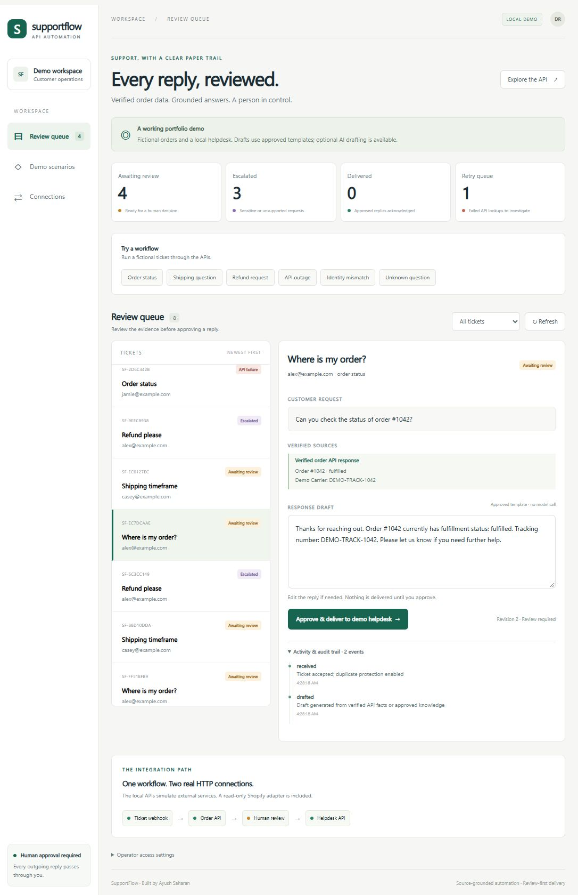
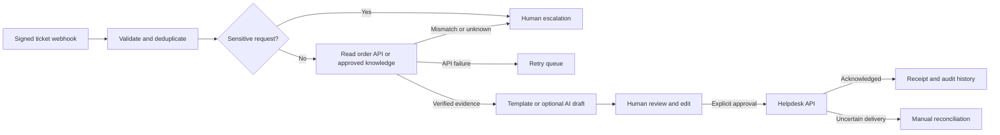

# SupportFlow

**Customer-support API automation with verified order lookup, grounded drafts, and human approval.**

[](https://github.com/Ayush-3000/supportflow-api-automation/actions/workflows/ci.yml)


SupportFlow turns a support ticket into an evidence-backed draft, presents it to a reviewer, and delivers the edited reply only after explicit approval. Sensitive requests and unsupported questions go to a human. Failed lookups can be retried; an uncertain delivery is held for investigation.

Built by **Ayush Saharan** as a portfolio demonstration. All examples use fictional customers, orders, policies, and helpdesk tickets. The default demo runs locally without paid services or real customer messages.



## What you can try

| Scenario | Workflow result |
| --- | --- |
| Order status | Query the order API, match order number and customer email, draft from verified facts |
| Shipping question | Find the approved shipping policy and show its source beside the draft |
| Refund request | Escalate before contacting the order API or model |
| API outage | Make bounded read retries, then put the ticket in the operator retry queue |
| Identity mismatch | Withhold order information when the customer/order combination does not match |
| Unknown question | Escalate when the knowledge collection has no matching source |

**Every draft waits for a person.** A reviewer can edit the reply, approve it, and inspect the delivery receipt and audit history. Approving an old revision or approving the same ticket twice returns a conflict instead of sending twice.

## Quick start

Requirements: Python 3.11 or newer and free local ports **8000** and **8001**.

```bash
git clone https://github.com/Ayush-3000/supportflow-api-automation.git
cd supportflow-api-automation
python -m venv .venv
```

Activate the environment:

```powershell
# Windows PowerShell
.venv\Scripts\Activate.ps1
```

```bash
# macOS / Linux
source .venv/bin/activate
```

Then install and start:

```bash
python -m pip install -e ".[dev]"
python scripts/run_demo.py
```

Open **http://127.0.0.1:8000**. Choose **Order status**, review the facts, edit the draft, then select **Approve & deliver to demo helpdesk**. The confirmation sends to the local mock helpdesk only. Choose the remaining scenarios to inspect escalation and failure handling. Stop both services with Ctrl+C.

PowerShell activation is optional: you can use `.venv\Scripts\python.exe` in place of `python` if activation is unavailable.

The demo launcher deliberately selects local providers, template drafting, demo credentials, and a separate demo database (`runtime/supportflow-demo.sqlite`). It does not enable live providers or a paid model from your environment. Set `SUPPORTFLOW_DEMO_DB` to use another demo database path.

## How it works



- **FastAPI** exposes a signed webhook, authenticated review endpoints, and interactive API documentation.
- **HTTPX** connects to a separate order API and helpdesk service over HTTP.
- **SQLite** persists ticket state, evidence, replies, revisions, and the audit history.
- **OpenAI Responses API** is an optional drafting adapter with structured JSON output. Default drafts are deterministic templates; the local demo makes no model calls.
- **Vanilla JavaScript and CSS** provide the review dashboard without a frontend build step.

## Integration status

| Component | Included | Validation |
| --- | --- | --- |
| Signed ticket ingestion | HMAC-SHA256, timestamp window, versioned schema, duplicate protection | Automated tests and local HTTP smoke check |
| Order lookup | Shopify Admin GraphQL query adapter; read-only code path | Contract tests and local Shopify-shaped mock API; **no live store connected** |
| Knowledge lookup | Small, explicit keyword lookup over versioned fictional policies | Automated tests; no vector database or embedding-based RAG |
| Optional AI | OpenAI Responses API, strict JSON schema, reference-draft fallback | Mocked HTTP contract tests; **no paid/live model call verified** |
| Helpdesk delivery | Reference REST gateway with idempotency key and receipt | Automated tests and actual HTTP delivery to a local mock |
| LiveAgent / other helpdesks | Implement a gateway or replace the adapter for that provider | **No native LiveAgent integration is included** |
| Docker demo | Dockerfile and Compose configuration | Provided; Docker execution has not been verified |

The helpdesk contract is documented in [docs/api.md](docs/api.md). A real provider must implement this contract or have its own tested adapter. This repository demonstrates the workflow and integration boundaries; it is not evidence of a deployed client system.

## Optional AI drafting

The two-service demo launcher keeps drafting offline. To test the optional AI adapter, run the mock API in one terminal:

```bash
python -m uvicorn supportflow.mock_api:app --host 127.0.0.1 --port 8001
```

In a second terminal, activate the same environment, configure your own account and a model that supports Structured Outputs, then start the workflow API:

```powershell
# Windows PowerShell — placeholder values, never commit real keys
$env:SUPPORTFLOW_DRAFTER = "openai"
$env:OPENAI_API_KEY = "YOUR_OPENAI_KEY"
$env:OPENAI_MODEL = "YOUR_SUPPORTED_MODEL"
python -m uvicorn supportflow.app:create_app --factory --host 127.0.0.1 --port 8000
```

```bash
# macOS / Linux
export SUPPORTFLOW_DRAFTER=openai
export OPENAI_API_KEY=YOUR_OPENAI_KEY
export OPENAI_MODEL=YOUR_SUPPORTED_MODEL
python -m uvicorn supportflow.app:create_app --factory --host 127.0.0.1 --port 8000
```

This mode can incur model charges when eligible tickets are processed. Customer message text and the selected evidence are sent to OpenAI, so use fictional test tickets first. `store: false` is set on the request; it does not by itself guarantee zero data retention. An invalid or incomplete model response keeps the reference draft. Structured output controls the response shape; a reviewer must still verify factual accuracy. No model tools or automatic send actions are available.

## Connect your own APIs

`.env.example` lists the configuration variables and contains demonstration values only. **Environment files are not loaded automatically.** Set the variables in your shell or deployment platform.

For `SUPPORTFLOW_MODE=live`, configure:

1. Unique `SUPPORTFLOW_API_KEY` and `SUPPORTFLOW_WEBHOOK_SECRET`, each at least 32 characters.
2. Your canonical `SHOPIFY_SHOP` domain, a stable `SHOPIFY_API_VERSION`, and `SHOPIFY_ACCESS_TOKEN` with the appropriate order-read permissions and approved access to required customer fields.
3. An HTTPS `HELPDESK_URL` gateway and `HELPDESK_API_KEY` implementing the documented reply contract.
4. A private, durable `SUPPORTFLOW_DB` location. The default is `runtime/supportflow.sqlite`.
5. Optional AI variables if you want model-generated drafts.

Start the API with `python -m uvicorn supportflow.app:create_app --factory --host 127.0.0.1 --port 8000`. Demo scenario endpoints are disabled in live mode. Supply the workspace key under **Operator access settings**; no real credentials are embedded in the page.

Before deployment, validate the live provider contracts and add authenticated reviewer identities, role permissions, rate limits, a TLS reverse proxy, ingress body limits, retention rules, and a background job queue. The current reviewer name is an operator-entered label, not a verified user identity. Customer email must come from a trusted helpdesk integration; comparing email fields alone is not customer authentication.

This is a single-process portfolio reference. Classification uses English keyword rules and can miss paraphrases or other languages. Knowledge matching is a simple overlap lookup, and every result requires human review. The dashboard shows the most recent 100 tickets and its counters summarize that view. SQLite startup recovery assumes one application worker; do not run multiple workflow workers against the same database. Webhook processing is synchronous; production senders may need a quick acknowledgement and asynchronous jobs.

## Send a signed webhook

With the local demo running:

```bash
python scripts/send_webhook.py --event-id demo-client-001
```

Run the same command again to see a duplicate response without another order lookup. The script signs the exact request bytes with a fresh timestamp. See [docs/api.md](docs/api.md) for schemas and signature verification.

## Tests

```bash
python -m ruff check .
python -m ruff format --check .
python -m pytest -q
```

The suite covers 50 cases, including duplicate events, changed payload conflicts, customer mismatch, sensitive-case escalation, provider failures, rate limits, stale approvals, concurrent state claims, ambiguous delivery, restart recovery beyond the dashboard limit, webhook tampering, and malformed AI responses. Tests use temporary databases and mocked outbound HTTP; they do not contact real providers. GitHub Actions runs the same checks on pushes and pull requests.

## Docker option

```bash
docker compose up --build
```

Compose exposes the dashboard on the host loopback interface and persists the demo database in a named volume. This option is supplied for convenience; the recorded verification used the Python launcher.

## Explore the project

- [Architecture and operational decisions](docs/architecture.md)
- [API contract and integration guide](docs/api.md)
- [Portfolio description and 90-second walkthrough](docs/showcase.md)
- [Verification record](docs/verification.md)
- [Interactive API docs](http://127.0.0.1:8000/docs) when running locally

Official references: [FastAPI](https://fastapi.tiangolo.com/), [Shopify orders query](https://shopify.dev/docs/api/admin-graphql/latest/queries/orders), [Shopify protected customer data](https://shopify.dev/docs/apps/launch/protected-customer-data), [OpenAI Structured Outputs](https://platform.openai.com/docs/guides/structured-outputs), [OpenAI API data controls](https://platform.openai.com/docs/guides/your-data).

## License

MIT. See [LICENSE](LICENSE).
