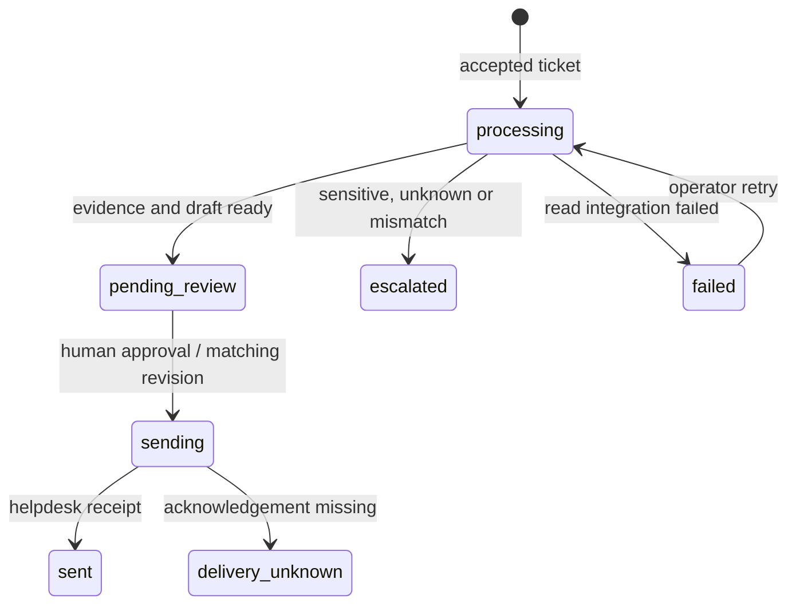

# Architecture

SupportFlow separates ticket decisions from API adapters and persistence so an integration can be replaced without removing the review gate.

## Components

| File | Responsibility |
| --- | --- |
| `supportflow/app.py` | Webhook signature validation, operator API authentication, demo routes, dashboard |
| `supportflow/models.py` | Strict versioned ticket and approval schemas |
| `supportflow/service.py` | Classification, evidence selection, drafting, review and delivery transitions |
| `supportflow/integrations.py` | Shopify-shaped GraphQL lookup, helpdesk gateway, optional OpenAI adapter |
| `supportflow/store.py` | Transactional state, duplicate protection, revision checks, restart recovery |
| `supportflow/mock_api.py` | Separate fictional order and helpdesk HTTP service |
| `supportflow/data/knowledge.json` | Versioned fictional policy sources |
| `supportflow/static/` | Browser review workspace |

## State transitions

There is no transition from `processing` directly to `sending`. A model does not receive send tools. Escalated tickets have no in-app delivery action; they require a support specialist in the original helpdesk.

## Duplicate protection and concurrency

An event has unique `event_id` and `ticket_id` values. The canonical validated payload is hashed. Replaying the same event returns the existing record; reusing either ID with different content returns HTTP 409. This reference handles one initial event per ticket, not an ongoing conversation stream. A production conversation integration would define a separate event/message identity and thread model.

SQLite `BEGIN IMMEDIATE` serializes the transition claim. Approval checks both state and revision before making the outbound call. A concurrent or stale approval cannot claim a ticket already in `sending` or `sent`. Read retries also claim a matching revision.

The outbound helpdesk call includes a stable `Idempotency-Key` based on the internal ticket ID. A real gateway must honor that key durably. The mock demonstrates the response contract with in-memory receipts; its receipts reset on restart.

## Read retries versus delivery uncertainty

Order lookups retry up to three times for 429, server errors and network timeouts. Server-error retries use bounded exponential backoff with jitter, or a capped integer `Retry-After`. Timeout retries use bounded exponential backoff. Non-retryable authorization or malformed-response errors fail immediately.

The order circuit opens after five transient failures within ten seconds and blocks new lookup operations for thirty seconds. The threshold counts HTTP attempts. It is process-local; it does not coordinate multiple workers.

After read failure, the ticket remains in a persistent `failed` queue. An operator can replay that workflow, up to five total workflow attempts. An outage scenario remains failed while the mock keeps returning 503; retrying is not a magic fix for the upstream cause.

Reply delivery is attempted once after approval. A timeout can mean the provider received the message but its acknowledgement was lost. Consequently, failures become `delivery_unknown`; no automatic resend or retry endpoint is available. The operator checks the real helpdesk and receipt before resolving or manually sending outside this app. A reconciliation endpoint is intentionally left for a provider-specific implementation.

At startup, all interrupted `processing` records become `failed` and interrupted `sending` records become `delivery_unknown`, including records older than the dashboard limit. Run one workflow worker so recovery cannot interfere with another active worker.

## Evidence and optional AI

Order facts are returned only when the order number and customer email uniquely match. They contain fulfillment status and tracking, not payment data, addresses or full order records. No Shopify mutations exist in the adapter.

Knowledge lookup uses keyword overlap over two explicitly approved demo sources. It does not implement semantic retrieval. Sensitive keywords are checked before evidence lookup or AI invocation. The rules are illustrative, not a comprehensive safety classifier.

The optional OpenAI adapter passes customer message text as untrusted input alongside evidence and the reference draft. It uses the Responses API with strict JSON output and no tools. Incomplete or malformed output falls back to the deterministic draft and records the reason. A structured schema does not establish truth; human fact checking remains necessary.

## Deployment boundary

The default API keys are public demo values. Local services bind to loopback. Live mode validates stronger secrets, a canonical Shopify domain and an HTTPS gateway URL, but is not a complete deployment security design.

Before connecting customer data, provide SSO/session authentication, verified reviewer identities, least-privilege roles, TLS, gateway signature translation, ingress size limits, rate limits, encrypted durable storage as appropriate, data retention/deletion controls, alerting, and provider contract tests. The current database stores email, ticket text and audit entries in plaintext. Audit history is application-managed and is not tamper-evident.

The webhook reads and processes the request synchronously. Use a queue and a fast acknowledgement for higher volume. This reference does not provide multi-worker startup recovery, distributed circuit state, attachment handling, customer authentication, multi-tenant isolation, or automatic helpdesk conversation updates.
